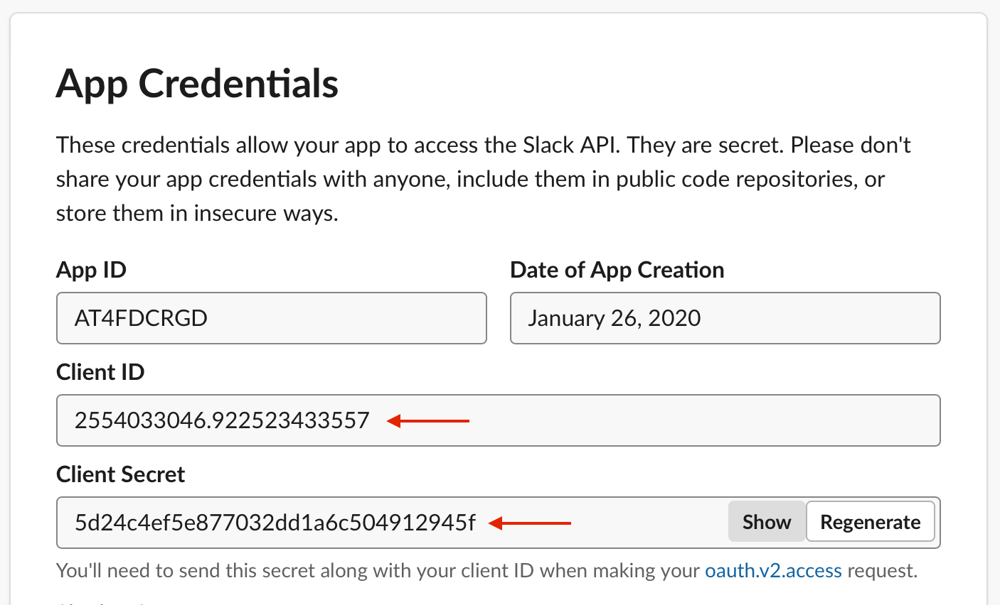
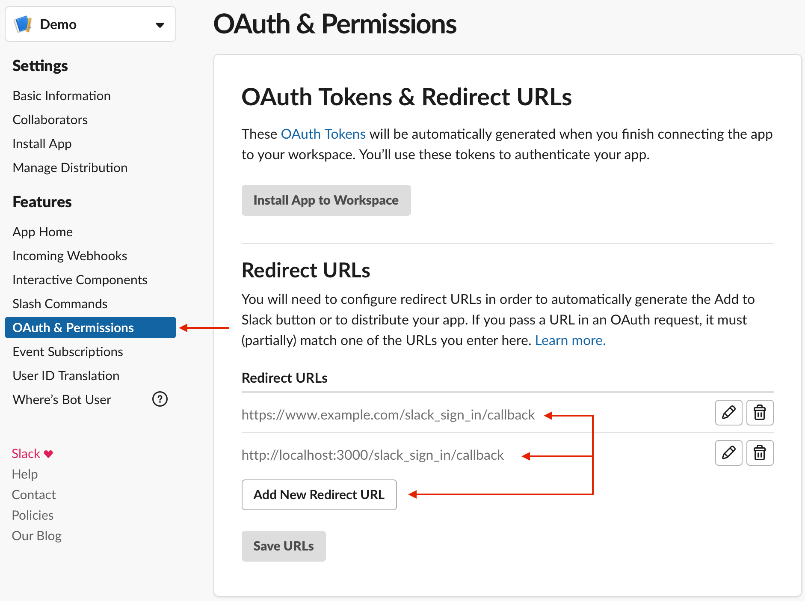

# Slack Sign-In for Rails

The goal of this gem is to get you up and running with Slack sign-ins:

  - with minimal configuration
  - as quickly as possible
  - without sacrificing on long-term stability and maintainability

The creation of this gem was heavily inspired by the awesome
[basecamp/google_sign_in](https://github.com/basecamp/google_sign_in) project,
both in its aspirations and in its implementation. If you need to add Google
sign-in to your Rails project, definitely check it out!

This project adheres to the Contributor Covenant
[code of conduct](./CODE_OF_CONDUCT.md). By participating, you are expected to
uphold this code. Please report unacceptable behavior to
research@teecom.com.

## Installation

Add `slack_sign_in` to your Rails app's Gemfile and run `bundle install`:

```ruby
gem "slack_sign_in"
```

*Note:* This gem requires Rails 5.2 or newer.

## Creating a Slack App

Before getting started, you'll likely need to set up a Slack application:

  1. Go to the [Slack applications list](https://api.slack.com/apps)

  2. Either click **Create New App**, or select an existing application

  3. Take note of your app's **Client ID** and **Client Secret**

     <details>
       <summary>Slack app credentials visual guide :framed_picture:</summary>

       
     </details>

  4. Under the **OAuth & Permissions** tab, add your app's callback URLs to the
     list of **Redirect URLs** section.

     This gem adds a single OAuth callback to your Rails application at
     `/slack_sign_in/callback`. For a production application, you might add a
     redirect URL of:

     ```
     https://www.example.com/slack_sign_in/callback
     ```

     To sign in with Slack in development, you would likely also add a redirect
     URL for your local environment. Something like:

     ```
     http://localhost:3000/slack_sign_in/callback
     ```

     <details>
       <summary>Slack app redirect URLs visual guide :framed_picture:</summary>

       
     </details>

## Configuration

With your Slack application set up, the next step is to configure your Rails
app to use it. Run `rails credentials:edit` to edit your app's
[encrypted credentials](https://guides.rubyonrails.org/security.html#custom-credentials)
and add the following:

```yaml
slack_sign_in:
  client_id: "[Your client ID here]"
  client_secret: "[Your client secret here]"
```

You're all set to use Slack sign-in now. The gem will automatically use these
client credentials! :tada:

Alternatively, you can provide the Slack credentials through an initializer
and environment variables:

```ruby
# config/initializers/slack_sign_in.rb
Rails.application.configure do
  config.slack_sign_in.client_id = ENV.fetch("SLACK_CLIENT_ID")
  config.slack_sign_in.client_secret = ENV.fetch("SLACK_CLIENT_SECRET")
end
```

**:warning: Important:** Take care to protect your client secret. It's a secret
after all!

### Scopes

By default, this gem will request the following scopes from Slack:

  - `identity.basic`
  - `identity.email`
  - `identity.avatar`

If these scopes don't suit your particular need, you can configure the gem to
use any of the
[supported Slack scopes](https://api.slack.com/docs/sign-in-with-slack#identity_scopes)
through an initializer:

```ruby
# config/initializers/slack_sign_in.rb
Rails.application.configure do
  config.slack_sign_in.scopes = %w(identity.basic identity.team)
end
```

### Mounting Root

By default, this gem will mount its routes at `/slack_sign_in`. If this doesn't
suit your needs, it can be configured through an initializer:

```ruby
# config/initializers/slack_sign_in.rb
Rails.application.configure do
  config.slack_sign_in.root = "sso/slack"
end
```

In this example, the gem would add a callback URL of `/sso/slack/callback`
rather than the default of `/slack_sign_in/callback`.

## Usage

This gem provides a `slack_sign_in_link` helper that generates a link that will
kick off the sign-in process:

```erb
<%= slack_sign_in_link proceed_to: create_session_url %>

<%= slack_sign_in_link "Sign In!", proceed_to: create_session_url %>

<%= slack_sign_in_link proceed_to: create_session_url do %>
  <div style="background: blue; padding: 10px; display: inline-block;">
    <%= slack_sign_in_image %>
  </div>
<% end %>
```

<details>
  <summary>Sign in link visuals :framed_picture:</summary>

  
</details>

Regardless of whether you use the default link, a text link, or a block link,
the `proceed_to` argument is always required. After authenticating with Slack,
we'll redirect to this URL with information on the authorization's success or
failure for your application to handle.

In most cases, that might look something like this:

```ruby
# config/routes.rb
Rails.application.routes.draw do
  # ...
  get "sessions/create", to: "sessions#create", as: :create_session
end
```

```ruby
# app/controllers/sessions_controller.rb
class SessionsController < ApplicationController
  include SlackSignIn::Authorization

  def create
    if slack_authorization.successful?
      render plain: slack_authorization.identity.name
    else
      render plain: slack_authorization.error
    end
  end
end
```

#### The `SlackSignIn::Authorization` Concern

The `SlackSignIn::Authorization` concern is the primary interface for accessing
information about the Slack sign-in process. It exposes a single method,
`slack_authorization`, which will give you a
[`SlackSignIn::Result`](#slacksigninresult) for the recently completed Slack
sign-in flow.

In the majority of cases, you should be able to use the
`SlackSignIn::Authorization` concern along with the `slack_authorization`
method to accomplish what you want. In some cases, you may need direct access to
the full Slack response, though.

Before redirecting to the specified `proceed_to` URL, this gem will either set
`flash[:slack_sign_in]["success"]` to the Slack response, or 
`flash[:slack_sign_in]["error"]` to an
[OAuth authorizaton code grant error](https://tools.ietf.org/html/rfc6749#section-4.1.2.1).
If you need direct access to the Slack response information, this is how you can
get it.

#### `SlackSignIn::Result`

The `SlackSignIn::Result` class provides an interface for handling the result of
a Slack sign-in attempt. It exposes three instance methods:

  1. `successful?` - to determine whether the sign-in attempt succeeded or not

  2. `identity` - either `nil` or a [`SlackSignIn::Identity`](#slacksigninidentity)
     instance with user identity information from Slack

  3. `error` - either `nil` or an
     [OAuth authorizaton code grant error](https://tools.ietf.org/html/rfc6749#section-4.1.2.1)

#### `SlackSignIn::Identity`

The `SlackSignIn::Identity` class decodes user identity information from Slack.
It exposes this information through a handful of instance methods:

  - `unique_id` - a unique identifier from Slack that can be used to look up
    people

  - `team_id` - the ID of the team used while signing in

  - `user_id` - the ID of the user who signed in

  - `name` - the name of the user who signed in

  - `email` - the email of the user who signed in

  - `avatar(size: 48)` - the avatar of the user who signed in
    (in a specific size). Typically the sizes provided by slack are
    `24x24`, `32x32`, `48x48`, `72x72`, `192x192`, and `512x512`.

## Contributing

For information on how to contribute to this project, check out the
[contributing guidelines](./CONTRIBUTING.md).

## Questions?

If you have any questions about, or if any of the documentation is unclear,
please feel free to reach out through a
[new issue](https://github.com/TEECOM/slack_sign_in/issues/new?labels=documentation%20:writing_hand:).

:smiley_cat:
